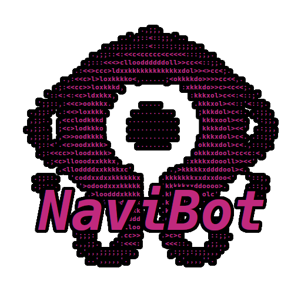
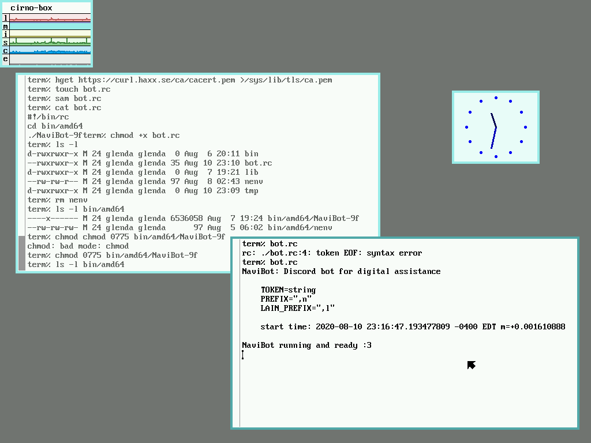

# NaviBot

### Introduction

_NaviBot is an open source, modular (soonTM), cross-platform Discord bot._

* Version: N/A (alpha software)
* Author: phossil

### Features
* Current features
    * Display bot uptime
    * Partially reimplemented [tacitgenesis/lainbot](https://github.com/tacitgenesis/lainbot) commands

* Planned features
    * Modular plugins
    * Manpage lookup

### Supported Operating Systems
* Linux amd64
* Linux armv6
* Plan 9 amd64
    * Currently 9front only

### Planned Support
* FreeBSD x86 and amd64

### Current Build Requirements
* go 1.14

### Notes
* Testing is currently limited to Void Linux on PC and Raspberry Pi B Rev 2 (2011.12), and 9front [2020/05/28](http://9front.org/releases/2020/05/28/0/) on PC
* If running on 9front, please be sure that TLS has the current certificates, which can be done by executing `hget https://curl.haxx.se/ca/cacert.pem >/sys/lib/tls/ca.pem`.
* The configuration file `nenv` must be in the same directory as the bot

*early alpha of NaviBot running on 9front*

### Links
* NaviBot Source Code
<https://github.com/phossil/NaviBot>
* DiscordGo Source Code
<https://github.com/bwmarrin/discordgo>
* Golang Installation
<https://golang.org/doc/install>
* Void Linux Home
<https://voidlinux.org/>
* 9front Home
<http://9front.org/>
* 9front FQA
<http://fqa.9front.org/>
* 9front FQA PDF
<http://fqa.9front.org/dash1.emailschaden.pdf>

### Extra
* NAVI
<https://lain.wiki/wiki/NAVI>
* Wired Sound
<https://fauux.neocities.org/>
